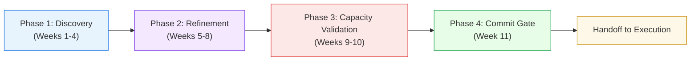
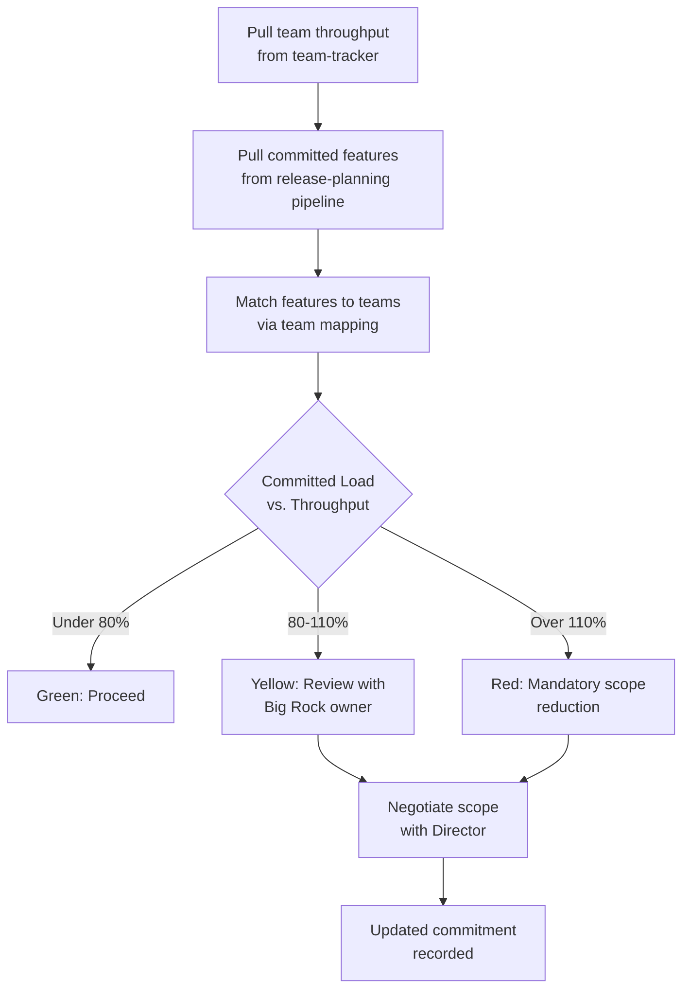
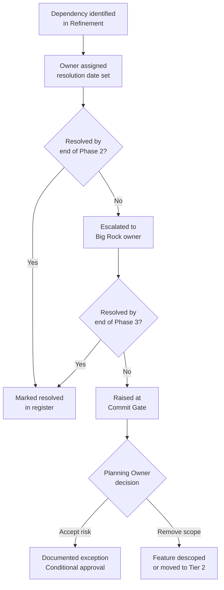

# AI Engineering Release Planning: Operational Proposal

**Author:** Planning Domain Owners
**Date:** 2026-04-22
**Status:** Draft for VP review
**Audience:** VP (approval), AI Engineering leadership, PgMs, Agilists

---

## Part 1: Executive Summary

### The Problem

AI Engineering ships quarterly releases of RHOAI, with three releases in flight at any time: one being planned, one being executed, and one being released. This cadence demands disciplined coordination across dozens of teams, hundreds of features, and multiple stakeholder groups. Today, that coordination relies heavily on tribal knowledge, informal handoffs, and manual tracking.

Three systemic issues undermine our ability to deliver predictably:

**Teams over-commit and descope late.** Big Rocks and features are committed into releases without validating them against team capacity. When reality catches up mid-cycle, features get descoped, which cascades into customer disappointment and cross-team rework. There is no mechanism to compare what we are committing against what teams can realistically deliver. The "commit" moment itself is undefined -- there is no formal gate between planning and execution, so scope creeps in after the plan is nominally locked.

**Lack of visibility creates drift.** Once a release enters execution, there is no consistent way to track whether the committed scope is on track. Cross-team and cross-domain dependencies are not systematically identified or tracked. When one team slips, downstream teams learn late. The operating model document identifies Execution as a separate domain, but without a clear handoff from Planning, Execution inherits an ambiguous scope baseline.

**Quality and readiness gaps persist.** Work is committed before it meets a Definition of Ready -- requirements are incomplete, dependencies are unresolved, and acceptance criteria are missing. This pushes refinement into the execution phase, consuming sprint capacity that was budgeted for delivery. The Definition of Ready exists as a concept but is not enforced through any workflow gate, Jira automation, or review ceremony.

### The Proposed Solution

This proposal defines the operational mechanics of the **Planning domain** -- the first of the three control domains in the operating model. It establishes:

1. A **planning lifecycle** with named phases, ceremonies, and deadlines tied to the quarterly release calendar
2. A **Definition of Ready enforcement model** with Jira workflow gates and review ceremonies
3. A **capacity alignment process** that validates Big Rock commitments against historical team throughput data
4. A **dependency management system** using Jira links and a dedicated tracking view
5. A **formal commit gate** -- the ceremony that transitions a release from Planning to Execution

The proposal maps each need against existing tooling in the People & Teams platform (release-planning, feature-traffic, release-analysis, team-tracker modules) and identifies specific gaps to close. It is honest about data limitations -- notably that capacity signals are directional estimates (not precise sprint velocity), that several pipeline extensions are needed before automated checks work, and that cross-module data access requires architectural care.

### Key Decisions Needed

1. **Adopt the commit gate ceremony?** Should we formalize a "Planning Complete" review as the handoff point to Execution, with authority to reject uncommitted work?
2. **Enforce DoR via Jira workflow?** Should we add a Jira workflow transition validator that blocks features from moving to "Committed" without meeting DoR criteria, or use a lighter-touch review-based approach?
3. **Capacity validation authority?** When capacity analysis shows a team is over-committed, who has final authority to cut scope -- the Planning Owner, the team's Director, or both jointly?
4. **Tooling investment level?** Should we build capacity planning into the release-planning module (estimated 5-6 sprint effort including prerequisites -- see Section 2.3 and Part 5 for details), or start with a manual spreadsheet-based approach?

### Expected Outcomes

- **Fewer mid-cycle descopes:** Capacity-validated commitments reduce the surprise factor
- **Clearer accountability:** The commit gate creates an unambiguous baseline for Execution
- **Earlier risk detection:** Dependency tracking and DoR enforcement surface problems in Planning, not Execution
- **Measurable process health:** Defined metrics let us track improvement quarter over quarter
- **Consistent quality bar:** Enforced DoR means Execution receives work that is actually ready to build

---

## Part 2: Planning Domain -- Deep Dive

### 2.1 Planning Lifecycle

The planning cycle runs continuously, offset by one release from Execution and two from Release. With quarterly cadence, planning for release N+1 begins as release N enters execution and release N-1 enters release.

#### Phases

The planning cycle has four phases, each with defined activities and exit criteria:



**Phase 1: Discovery (Weeks 1-4 of planning cycle)**

Activities:
- Product Management defines or refines Big Rocks for the upcoming release
- Big Rocks are entered into the release-planning module with pillar, owner, and outcome keys
- Google Doc import workflow used for bulk Big Rock ingestion from PM planning documents
- SmartSheet milestone dates (EA1/EA2/GA) are pulled for the target release version
- Initial feature discovery: Tier 1 pipeline runs to identify features linked to Big Rock outcomes

Inputs:
- Strategy priorities from leadership
- Customer RFEs (RHAIRFE project)
- Carryover items from previous release
- SmartSheet milestone dates

Outputs:
- Prioritized Big Rock list in the release-planning module
- Initial feature/RFE candidate list (Tier 1 + Tier 2)
- Milestone dates confirmed

Exit criteria:
- All Big Rocks have named owners
- All Big Rocks have at least one outcome key linked in Jira (or documented reason for none)
- SmartSheet milestone dates are confirmed and loaded

**Phase 2: Refinement (Weeks 5-8)**

Activities:
- Feature-level refinement: each Tier 1 and Tier 2 feature is assessed against the Definition of Ready
- Cross-team dependency identification (see Section 2.4)
- PM assigns features to pillars and validates target release versions in Jira
- Tier 3 discovery (in-progress orphans) reviewed for inclusion or explicit exclusion
- RFE triage: customer-driven RFEs assessed for alignment with Big Rocks

Inputs:
- Big Rock list with outcome keys
- Feature candidate list from Phase 1
- Team input on feasibility

Outputs:
- Features marked as "Ready" or "Not Ready" against DoR checklist
- Dependency map (initial)
- Updated Big Rock notes with refinement status

Exit criteria:
- At least 80% of Tier 1 features meet Definition of Ready
- All cross-team dependencies identified and logged
- Each Big Rock owner has reviewed and confirmed their feature list

**Phase 3: Capacity Validation (Weeks 9-10)**

Activities:
- Historical throughput data pulled from team-tracker (resolved issues per person per month, aggregated to team level)
- Committed scope compared against team throughput using the capacity equation (see Section 2.3)
- Over-committed teams identified; scope negotiation with Big Rock owners and team Directors
- Allocation-tracker sprint data reviewed for teams using the 40-40-20 model (where available -- this module is opt-in)
- Final dependency review: all dependencies have named owners and resolution dates

Inputs:
- Refined feature list with DoR status
- Team throughput data (from team-tracker module -- person-level issue resolution counts)
- Sprint allocation data (from allocation-tracker module, where enabled)
- Dependency map

Outputs:
- Capacity analysis per team (committed feature count vs. historical throughput)
- Scope adjustment recommendations
- Final dependency register with owners

Exit criteria:
- No team is committed beyond 110% of historical throughput as measured by the capacity equation (with documented exceptions). See Section 2.3 for caveats on this threshold.
- All dependencies have resolution owners
- Scope adjustments agreed between Planning Owner and team Directors

**Phase 4: Commit Gate (Week 11)**

Activities:
- Formal "Planning Complete" review (see Section 2.1.1 below)
- Final Big Rock priority confirmation
- Commit gate approval or conditional approval with action items
- Handoff package prepared for Execution Owner

Inputs:
- Capacity-validated feature list
- DoR compliance report
- Dependency register
- Risk summary

Outputs:
- Signed-off release scope baseline
- Handoff package to Execution domain
- Published release plan (Big Rocks, features, milestones, dependencies)

Exit criteria:
- Commit gate ceremony completed
- Planning Owner and Execution Owner have jointly reviewed the scope
- Baseline recorded in release-planning module

#### 2.1.1 The Commit Gate Ceremony

The commit gate is the single most important ceremony in this model. It is the formal moment when Planning transfers ownership of a release scope to Execution.

**Format:** 90-minute meeting, held in Week 11 of the planning cycle

**Attendees:**
- Planning Owner -- presenting
- Execution Owner -- receiving
- Release Owner -- observer / quality input
- PgMs (all pillars represented)
- Agilists
- Directors (each org represented)

**Agenda:**

| Time | Topic | Owner |
|------|-------|-------|
| 0-15 min | Big Rock overview: priorities, owners, expected outcomes | Planning Owner |
| 15-35 min | Feature scope walkthrough by pillar/team (Tier 1 + Tier 2) | PgMs |
| 35-50 min | Capacity analysis: team-by-team fit assessment | Agilist |
| 50-65 min | Dependency register review | PgM |
| 65-80 min | DoR compliance report and remaining gaps | Planning Owner |
| 80-90 min | Decision: Approve / Conditional Approve / Defer | All Directors |

**Decision outcomes:**

- **Approved:** Scope is baselined. Execution Owner takes ownership. No further scope additions without formal change request.
- **Conditional Approval:** Scope is baselined with documented action items (e.g., "Feature X must complete DoR by Week 2 of Execution or is auto-descoped"). Execution Owner takes ownership with conditions.
- **Deferred:** Planning cycle extends by 1-2 weeks. Specific gaps are identified with owners and deadlines.

**Post-ceremony:**
- Release-planning module snapshot is taken as the committed baseline
- Execution Owner receives the handoff package
- Planning Owner's active involvement in the release ends (shifts to next release's Phase 1)

#### Lifecycle Diagram (Three Releases in Flight)

```mermaid
gantt
    title Three Releases in Flight (Quarterly Cadence) — Illustrative Dates
    dateFormat YYYY-MM-DD

    section Release N-1
    Release Domain (N-1)        :active, rn1, 2026-07-01, 2026-09-30

    section Release N
    Execution Domain (N)        :active, en, 2026-07-01, 2026-09-30

    section Release N+1
    Planning: Discovery         :p1, 2026-07-01, 2026-07-28
    Planning: Refinement        :p2, 2026-07-29, 2026-08-25
    Planning: Capacity Valid.   :p3, 2026-08-26, 2026-09-08
    Planning: Commit Gate       :milestone, p4, 2026-09-12, 1d
    Execution Domain (N+1)      :en1, 2026-09-15, 2026-12-31
```

> **Note:** Dates above are illustrative, showing a generic quarterly cadence. Actual dates will be derived from SmartSheet milestone dates for each specific release version.

### 2.2 Definition of Ready (Enforcement Model)

#### What the DoR Contains

The DoR operates at two levels: Big Rock and Feature.

**Big Rock Definition of Ready:**

| # | Criterion | Verification Method |
|---|-----------|-------------------|
| BR-1 | Named owner (Director-level or delegate) | release-planning module: `owner` field populated |
| BR-2 | At least one outcome key linked in Jira | release-planning module: `outcomeKeys` array non-empty |
| BR-3 | Pillar assignment | release-planning module: `pillar` field populated |
| BR-4 | Success criteria documented (what does "done" look like for this Big Rock?) | release-planning module: `description` field or linked Jira outcome summary |
| BR-5 | Feature list identified (Tier 1 pipeline has run) | release-planning module: pipeline results show >0 features for this rock |
| BR-6 | Dependencies on other Big Rocks identified | Dependency register (see Section 2.4) |

**Feature Definition of Ready:**

| # | Criterion | Verification Method |
|---|-----------|-------------------|
| F-1 | Clear title and description in Jira | Jira `summary` and `description` fields non-empty |
| F-2 | Target release version set | Jira `customfield_10855` (Target Version) matches the release |
| F-3 | Acceptance criteria defined | Jira description or linked doc contains testable acceptance criteria |
| F-4 | PM assigned | Jira `customfield_10469` (Product Manager) populated |
| F-5 | Delivery owner assigned | Jira `assignee` field populated |
| F-6 | Component/team assignment | Jira `components` field populated |
| F-7 | Estimated scope (story points or T-shirt size) | Jira `customfield_10028` (story points) > 0, or size label present. **Note:** Story points are not currently fetched by the release-planning pipeline -- this field must be added to the pipeline before automated DoR checks can verify F-7 (see Section 2.3 prerequisites). |
| F-8 | Dependencies identified and linked | Jira issue links present for blocking/blocked-by relationships |
| F-9 | RFE linkage (if customer-driven) | Jira link to RHAIRFE issue, or explicit "no RFE" label |
| F-10 | Release type/phase specified | Jira `customfield_10851` (Release Type) set (EA1/EA2/GA) |

#### How Enforcement Works

We recommend a **two-tier enforcement model** that combines automated checks with human review:

**Tier 1: Automated Jira checks (always-on)**

A Jira automation rule or scheduled script checks DoR criteria for any feature with `status = "Committed"` and a target release version. Features that fail are flagged with a `dor-incomplete` label and their PM is notified via Jira comment.

Implementation: A new endpoint in the release-planning module server (`POST /releases/:version/dor-check`). This endpoint checks criteria in two tiers based on data availability:

**Checkable from cached pipeline data (no additional Jira calls):**
- F-1 (partial): `summary` is present in the pipeline cache. However, `description` content is not stored by `mapToCandidate()` -- only the summary is retained. Checking description non-emptiness requires a Jira call.
- F-2: `targetRelease` field is in the pipeline cache.
- F-4: `pm` field is in the pipeline cache.
- F-5: `deliveryOwner` (assignee) is in the pipeline cache.
- F-6: `components` field is in the pipeline cache.
- F-10: `phase` (release type) field is in the pipeline cache.

**Requires fresh Jira API calls (not in pipeline cache):**
- F-1 (description): The pipeline requests the `description` field from Jira but `mapToCandidate()` does not include it in the candidate object. Either extend the candidate model to store a `hasDescription` boolean, or make a targeted Jira call. Note: Jira Cloud stores descriptions in ADF (Atlassian Document Format) -- use the existing `adfToPlainText()` function from `jira-client.js` to extract text for non-emptiness checks.
- F-7: Story points (`customfield_10028`) are not in the pipeline -- requires a Jira call or pipeline extension (see Section 2.3 prerequisites).
- F-8: Full issue links are not stored (see Section 2.4). The pipeline fetches `issuelinks` but `mapToCandidate()` discards them. Requires either pipeline extension or a Jira call.

**Impact on effort estimate:** The DoR check endpoint needs to make supplementary Jira API calls for criteria not in the cache (F-1 description, F-7, F-8). This can be done efficiently via batch JQL queries using the existing `batchFetchLinkedIssues()` utility. Estimated effort remains 1 sprint but is at the higher end of that estimate.

**Tier 2: Human review (ceremony-based)**

Criteria F-3, F-8, and F-9 require human judgment (quality of acceptance criteria, completeness of dependency identification). These are verified in the weekly **Refinement Review** during Phase 2:

- **Who:** PM for each pillar + Planning Owner + Agilist
- **When:** Weekly during Refinement phase (Weeks 5-8), 30 minutes per pillar
- **Format:** Walk through each feature, review DoR checklist, mark as Ready or Not Ready
- **Outcome:** Features marked Ready in Jira (label `dor-complete`); Not Ready features get action items with owners and deadlines

**Escalation path:**

Features that do not meet DoR by end of Phase 2 (Week 8) are flagged to the Big Rock owner. If still not ready by end of Phase 3 (Week 10), they are:
1. Removed from Tier 1 scope and downgraded to Tier 2 ("nice to have")
2. Or explicitly accepted with a documented risk exception signed by the Big Rock owner and Planning Owner

#### Who Enforces and When

| Phase | Enforcer | Action |
|-------|----------|--------|
| Discovery (Weeks 1-4) | PMs | Populate Big Rock DoR fields in release-planning module |
| Refinement (Weeks 5-8) | PMs + Agilist | Weekly DoR review; flag incomplete features |
| Capacity Validation (Weeks 9-10) | Planning Owner | Final DoR compliance check; escalate blockers |
| Commit Gate (Week 11) | Planning Owner | DoR compliance is a gate condition for commit approval |

### 2.3 Capacity Alignment

#### How Commitments Are Validated Against Team Capacity

Capacity alignment is the process of comparing what we plan to commit against what teams have historically demonstrated they can deliver. This is not about precision -- it is about catching gross mismatches before they become mid-cycle crises.

**The Capacity Equation:**

```
Committed Load (feature count or story points) <= Historical Throughput x Availability Factor
```

Where:
- **Committed Load** = count of committed features assigned to a team in the release, weighted by story points when available. See note below on story points.
- **Historical Throughput** = average monthly resolved-issue count per team from team-tracker data (trailing 6 months). This is person-level issue resolution aggregated to the team level -- it is *not* sprint-based velocity in the Scrum sense. See "Data limitations" below.
- **Availability Factor** = adjustment for holidays, team changes, and allocation model (e.g., 40% for teams using 40-40-20)

**Data limitations (important caveats):**

1. **Story points are not in the release-planning pipeline today.** The pipeline's `mapToCandidate()` function does not fetch or store `customfield_10028` (story points). Team-tracker's person-metrics module does fetch story points for individual issues, but that data is not available per-feature in the release-planning context. **Prerequisite:** The release-planning pipeline must be extended to include story points in the candidate data model before the capacity dashboard can use point-based load calculations. Until then, capacity analysis will use feature counts as a proxy.

2. **"Velocity" here means monthly throughput, not sprint velocity.** Team-tracker's `/team/:teamKey/metrics` endpoint returns individual issue resolution counts summed across a team over a trailing 365-day window. This is useful for relative comparison (Team A resolves ~30 issues/month, Team B resolves ~50) but it does not translate directly to "features committable per quarter." Feature-level issues in RHAISTRAT are coarser than the stories and bugs measured by team-tracker. The capacity dashboard should present this as a *directional signal* rather than a precise capacity number.

3. **Sprint-based velocity is available but opt-in.** The allocation-tracker module has true sprint-level data (committed vs. delivered per sprint via the Sprint Report API), but it has `defaultEnabled: false` and may not be operational in all deployments. Where available, sprint data is a better capacity signal. The capacity dashboard should use it as *optional enrichment* -- improving the estimate when present, but not requiring it.

**Process:**



> **Note on the 110% threshold:** Given that the throughput metric is based on person-level issue resolution counts (not sprint-scoped feature velocity), the 80%/110% thresholds are heuristic guardrails, not precise capacity limits. They are intended to flag teams that appear significantly over-committed relative to their historical output rate. The thresholds should be calibrated after the first cycle of use and adjusted based on retrospective data.

#### Team Identity Mapping (Prerequisite)

A key prerequisite for the capacity dashboard is resolving the **team identity mismatch** between modules:

- **Team-tracker** identifies teams via roster composite keys (`orgKey::teamName`, e.g., `shgriffi::Model Serving`), derived from the LDAP/Google Sheets roster sync.
- **Release-planning** identifies teams via Jira `components` (e.g., `"Model Serving, KServe"` -- a comma-joined string, not a structured array) and a custom team field.

There is no automatic mapping between these two identity systems. The capacity dashboard cannot match features to team-tracker throughput data without solving this.

**Proposed solution:** A manually-maintained **team mapping table** stored in the release-planning module configuration (`data/release-planning-config.json`), managed via the Settings UI. Each entry maps a Jira component string (or substring) to a team-tracker composite key:

```json
{
  "teamMapping": [
    { "component": "Model Serving", "teamKey": "shgriffi::Model Serving" },
    { "component": "KServe", "teamKey": "shgriffi::Model Serving" },
    { "component": "Pipelines", "teamKey": "shgriffi::Pipelines" }
  ]
}
```

The capacity endpoint should parse the comma-separated `components` string into individual component names and match each against this table. Unmatched components should be flagged in the UI for the admin to map. This adds ~0.5 sprints to the capacity dashboard effort estimate.

#### Module Isolation: How the Capacity Endpoint Accesses Team-Tracker Data

The `shared/API.md` stability contract states that **modules cannot import from other modules**. The capacity endpoint in release-planning needs team-tracker throughput data, which creates a cross-module data dependency.

**Recommended approach: internal HTTP calls.** The release-planning server will make internal HTTP requests to team-tracker's API endpoints (e.g., `GET /api/modules/team-tracker/...` or the legacy-forwarded `GET /api/team/:teamKey/metrics`). This is the safest pattern because:
- It respects the module isolation contract
- It uses the same API surface that the frontend already consumes
- It does not create hidden coupling between module internals

The capacity endpoint will cache team-tracker responses for the duration of a single request to avoid repeated round-trips. This adds minimal latency since both modules run in the same Express process (requests are in-process, not over the network).

#### Where Capacity Data Comes From

| Data Source | Module | What It Provides | Availability |
|------------|--------|-----------------|--------------|
| Monthly resolved-issue counts per person | team-tracker | Historical throughput aggregated to team level (trailing 12 months) | Always available |
| GitHub/GitLab contributions | team-tracker | Code throughput signal (supplementary) | Always available |
| Story points on committed features | release-planning pipeline | Effort estimate per feature | **Not yet available** -- pipeline must be extended (see prerequisite above) |
| Component-level velocity | release-analysis | Issues resolved per Jira component per 2-week window (6-month baseline) | Always available |
| Sprint velocity (committed vs. delivered) | allocation-tracker | Per-sprint allocation against 40-40-20 model | **Optional** -- module is disabled by default |
| Team headcount | team-tracker roster | Current team size (from roster sync) | Always available |

#### What the Release-Planning Module Needs to Add vs. What Is Manual

**Already available (no changes needed):**
- Big Rock list with features mapped to teams (via Jira `components` field -- note: comma-joined string, needs parsing)
- Feature counts and priority breakdown per Big Rock (pipeline output: `perRockStats`)
- SmartSheet milestone dates (EA1/EA2/GA targets, plus freeze dates -- see Section 2.5)
- Team throughput data accessible via team-tracker API (via internal HTTP)
- Component-level velocity in release-analysis

**Prerequisites to build first:**
- **Story points in pipeline** (`customfield_10028`): Add story points to `getRequestedFields()` and `mapToCandidate()` in `jira-client.js`. Small change (~0.5 sprints), but required before the capacity dashboard can use point-based load calculations.
- **Team mapping configuration**: Admin-managed table mapping Jira components to team-tracker composite keys (~0.5 sprints, can be done in parallel with story points).

**Needs to be built (after prerequisites):**
- **Capacity dashboard view** in release-planning: a new client view that pulls team throughput from team-tracker API (via internal HTTP) and compares it against the committed feature load from the pipeline. Displays green/yellow/red per team. Uses allocation-tracker sprint data as optional enrichment when available. Estimated effort: 3-4 sprints (increased from original 2-3 to account for team mapping, story points integration, and internal HTTP plumbing).
- **Capacity snapshot endpoint** (`GET /releases/:version/capacity`): server-side aggregation that joins pipeline results with team-tracker throughput data via internal HTTP calls. Returns per-team capacity utilization. Estimated effort: 1-2 sprints.

**Manual for now (consider automating later):**
- Availability factor adjustments (holidays, team changes) -- entered by PgMs
- Scope negotiation decisions -- recorded as Big Rock notes in the release-planning module
- Override approvals for over-committed teams -- tracked via Jira comments or meeting notes

### 2.4 Dependency Management

#### How Dependencies Are Identified During Planning

Dependencies are identified at two levels:

**Feature-level dependencies** (cross-team):
- Identified during Phase 2 Refinement as PMs review each feature's DoR
- Captured as Jira issue links (`blocks` / `is blocked by`)
- The release-planning pipeline requests `issuelinks` from Jira (see `jira-client.js` `getRequestedFields`), but **the `mapToCandidate()` function discards the full issuelinks array** -- it only extracts the RFE link (via `getRfeLink()`) and parent RFE key (via `getParentRfeKey()`). The raw link data (link type, linked issue key, status, summary) is not stored in the pipeline output.

**Big Rock-level dependencies** (cross-domain):
- Identified during Phase 1 Discovery as Big Rock owners review their scope
- Captured in the Big Rock `notes` field in release-planning, and as a separate dependency register

#### Tracking Mechanism

**Short-term (immediate, no tooling changes):**
- Jira issue links for feature-level dependencies (already supported by Jira natively)
- A shared Google Sheet or Confluence page for the cross-Big-Rock dependency register
- PgMs maintain the register and review it weekly during Refinement

**Medium-term (release-planning module enhancement):**
- New **dependency view** in the release-planning client that visualizes cross-team dependencies from Jira issue links
- **Server-side pipeline changes required:** The `mapToCandidate()` function must be extended to preserve the full `issuelinks` array in the candidate data model. Currently it only extracts RFE-specific links and discards the rest. Each link should include: link type (e.g., `blocks`, `is blocked by`), linked issue key, linked issue status, and linked issue summary. This is a moderate change to `jira-client.js` and will increase the size of the cached pipeline output.
- Client-side: render the preserved link data as a directed graph, filterable by Big Rock, team, or status, with highlights on blocked items and critical path
- Estimated effort: 3 sprints (increased from 2 to account for the pipeline changes, data model extension, and increased cache size)

**Dependency data model (what the pipeline provides today vs. what is needed):**

The `jira-client.js` module *requests* `issuelinks` from Jira for every feature and RFE. However, `mapToCandidate()` only extracts:
- The RFE link (via `getRfeLink()`) -- stored as `rfe` and `rfeStatus` fields
- The parent RFE key (via `getParentRfeKey()`) -- stored as `rfe` field

The full issuelinks array (which includes `blocks`, `is blocked by`, `is required by`, and other relationship types with their linked issue keys, statuses, and summaries) is **discarded**. The pipeline change must add a `dependencies` array to each candidate:

```json
{
  "dependencies": [
    { "type": "blocks", "key": "RHAISTRAT-1234", "status": "In Progress", "summary": "..." },
    { "type": "is blocked by", "key": "RHAISTRAT-5678", "status": "New", "summary": "..." }
  ]
}
```

#### Escalation Path for Unresolved Dependencies



### 2.5 Tooling Gap Analysis

| Need | Current Tool/Process | Gap | Recommended Action |
|------|---------------------|-----|-------------------|
| Big Rock management | **release-planning module** -- full CRUD, validation, reordering, backups, Google Doc import, PM role-based access | None -- fully operational | Continue using as-is |
| Feature discovery | **release-planning pipeline** -- 3-tier Jira discovery (Tier 1: Big Rock outcomes, Tier 2: version-matched unaffiliated, Tier 3: in-progress orphans) | None -- fully operational | Continue using as-is |
| Milestone dates | **SmartSheet integration** (`shared/server/smartsheet.js`) -- auto-discovers EA1/EA2/GA dates from SmartSheet | SmartSheet stores all 6 milestones (EA1/EA2/GA freeze *and* target dates), but `discoverReleases()` only returns target dates (`ea1Target`, `ea2Target`, `gaTarget`). **Freeze dates are parsed internally but not surfaced in the API response.** | Extend `discoverReleases()` to include freeze dates in the response. Minor change (~0.5 sprints). Freeze dates are needed for commit gate timing (the commit gate should land before the earliest code freeze). |
| Capacity planning | **team-tracker** has throughput data (person-level issue resolution); **allocation-tracker** has sprint-level allocation targets (opt-in); **release-analysis** has component velocity | **No unified view** comparing committed scope against team capacity. Team identity mismatch between modules (see Section 2.3). Story points not in pipeline. | Build capacity dashboard in release-planning module (Phase 2 of roadmap). Requires prerequisites: story points in pipeline, team mapping config (see Section 2.3). |
| Dependency tracking | **Jira issue links** requested by pipeline but **discarded by `mapToCandidate()`** -- only RFE links are preserved | **No dependency data in pipeline output** and **no dependency visualization**. Both server and client changes needed. | Extend pipeline to preserve full issuelinks; build dependency view in client (Phase 2 of roadmap). |
| DoR enforcement | Definition exists conceptually; not enforced in any workflow | **No automated DoR checks**; no Jira workflow gates | Build DoR check endpoint + Jira labels (Phase 1 of roadmap); establish review ceremony immediately |
| Commit gate | **Does not exist** -- no formal ceremony or artifact | **Completely undefined** -- the handoff from Planning to Execution is informal | Define and institute the ceremony (Phase 1 of roadmap -- process only, no tooling needed) |
| Feature delivery tracking | **feature-traffic module** -- tracks delivery across repos/components with health scores | Operates independently from release-planning; no cross-link | Consider linking feature-traffic data into execution-phase tracking (Execution Owner's scope) |
| Release risk analysis | **release-analysis module** -- risk scoring based on incomplete issues vs. time remaining, component velocity, sprint detection | Operates on Jira Fix Versions / Product Pages releases; not directly linked to Big Rocks | Useful during Execution phase; recommend Execution Owner adopts as primary dashboard |
| Release milestones | **release-analysis** has Product Pages integration (OAuth-authenticated, production milestone dates); **release-planning** has SmartSheet dates (planning milestone dates, including freeze dates) | **Two separate milestone sources with no reconciliation.** If SmartSheet and Product Pages dates diverge, the Planning and Release domains will operate from different schedules. This is a real risk -- SmartSheet dates are maintained by PgMs, while Product Pages dates are maintained by Release Engineering. | **Authoritative source by domain:** SmartSheet is authoritative for *planning* milestones (the dates that govern the planning lifecycle and commit gate timing). Product Pages is authoritative for *release* milestones (the dates that govern EA/GA availability). **Reconciliation process:** At the start of each planning cycle (Phase 1), the Planning Owner should verify that SmartSheet and Product Pages dates agree. If they diverge, escalate to the Release Owner for resolution before proceeding past Phase 1. Consider a future automated check that flags date mismatches. |
| Reporting/dashboards | Each module has its own dashboard | **No cross-module release health view** | Longer-term: unified release dashboard pulling from all modules (Phase 3 of roadmap) |
| PM workflow | **release-planning** has PM role-based access control | Works well; PMs can edit Big Rocks and import data | Continue using as-is |
| Prioritization | **release-planning** has priority ordering with reorder API | Works well for Big Rock-level prioritization | Extend to feature-level priority within Big Rocks (minor enhancement) |

### 2.6 Prioritization Framework

#### How Big Rocks and Features Are Prioritized

**Big Rock prioritization:**

Big Rocks are prioritized by the Planning Owner in consultation with Product Management and strategy leadership. The release-planning module supports explicit priority ordering (integer priority, drag-to-reorder in the UI, `PUT /releases/:version/big-rocks/reorder` API).

Priority factors (in order of weight):
1. **Strategic alignment:** Does this Big Rock directly support announced strategy themes?
2. **Customer demand:** Are there linked RFEs with significant customer weight?
3. **Continuation vs. new:** Continuing work (state: "continue from N-1") generally takes priority over new starts, because stopping mid-stream is wasteful
4. **Cross-release dependencies:** Does another Big Rock or release depend on this completing?
5. **Technical risk:** Higher-risk items may be prioritized earlier to allow time for course correction

**Feature prioritization within a Big Rock:**

Features within a Big Rock are currently sorted by Jira priority (Blocker > Critical > Major > Normal > Minor) as implemented in the pipeline's `sortByPriority` function. This is a reasonable default but should be supplemented with PM judgment.

Recommendation: Add a `featurePriority` override field to the pipeline output that PMs can set, which overrides the Jira priority sort within a Big Rock. This is a minor enhancement to the release-planning module.

#### The Tier System: Assessment

The current 3-tier system is well-designed and maps cleanly to commitment levels:

| Tier | Description | Commitment Level |
|------|-------------|-----------------|
| **Tier 1** | Big Rock-associated features -- PM has identified as essential | **Committed** -- these are the baseline scope for the release |
| **Tier 2** | Features not tied to Big Rocks but important for customers or usability | **Best effort** -- delivered if capacity allows after Tier 1 is satisfied |
| **Tier 3** | In-progress features with no target version and no fix version (orphans not claimed by any release) | **Opportunistic** -- teams may work on these in slack time; not committed |

This tier system is sufficient. The key improvement is making the tier designation binding at the commit gate: Tier 1 is what we commit to; Tier 2 and 3 are explicitly not committed.

#### Who Has Authority to Change Priority and When

| When | Who Can Change | Scope of Change | Approval Required |
|------|---------------|-----------------|-------------------|
| Discovery (Weeks 1-4) | PMs | Any -- Big Rock and feature priority is fluid | Big Rock owner |
| Refinement (Weeks 5-8) | PMs with Big Rock owner agreement | Feature priority within a Big Rock; add/remove Tier 2 features | Big Rock owner |
| Capacity Validation (Weeks 9-10) | Planning Owner | Remove features from Tier 1; adjust Big Rock priority | Director of affected team |
| After Commit Gate | Execution Owner | Scope changes require a **Change Request** reviewed by Planning Owner | Planning Owner + Director + Execution Owner |

---

## Part 3: Lightweight Recommendations for Execution & Release

### 3.1 Execution Domain

The Execution domain spans from the commit gate to feature completion. Its job is to ensure what was committed actually gets delivered.

#### Key Ceremonies

| Ceremony | Frequency | Attendees | Purpose |
|----------|-----------|-----------|---------|
| **Execution Stand-up** | Weekly, 30 min | Execution Owner, PgM, Agilist, Big Rock owners | Progress against committed scope; surface blockers |
| **Risk Review** | Bi-weekly, 45 min | Execution Owner, Directors, PgMs | Review at-risk features using release-analysis risk scores; decide on interventions |
| **Dependency Sync** | Weekly, 15 min | PgM + dependency owners | Status check on cross-team dependencies from the dependency register |
| **Mid-Cycle Checkpoint** | Once, at mid-cycle | All Directors, PgMs, Execution Owner | Formal "are we on track?" assessment with go/no-go for at-risk scope |

#### Key Metrics

- **Scope stability:** % of Tier 1 features that remain committed from gate to completion (target: >90%)
- **Delivery velocity:** Actual vs. planned feature completion rate per sprint
- **Blocker aging:** Average time from blocker identification to resolution
- **Dependency resolution rate:** % of dependencies resolved on schedule

#### Tooling Considerations

The Execution domain should adopt:
- **release-analysis module** as the primary execution dashboard (already provides risk scoring, component velocity, sprint detection)
- **feature-traffic module** for tracking delivery progress across repos and components
- **team-tracker** for sprint-level visibility into team throughput

#### Handoff from Planning

The commit gate ceremony produces the handoff package:
1. Release scope baseline (Big Rocks, Tier 1 features, milestone dates)
2. Dependency register with owners and resolution dates
3. DoR compliance report (any conditional items)
4. Capacity analysis (team-by-team utilization)
5. Known risks and mitigation plans

The Execution Owner should review this package and confirm acceptance within 48 hours of the commit gate.

### 3.2 Release Domain

The Release domain spans from feature completion to GA. Its job is to ensure what was built is shippable.

#### Key Ceremonies

| Ceremony | Frequency | Attendees | Purpose |
|----------|-----------|-----------|---------|
| **Release Readiness Review** | Weekly during release phase | Release Owner, PgM, QE leads | Track readiness against release checklist |
| **Go/No-Go Decision** | At each milestone (EA1, EA2, GA) | Release Owner, Directors, Execution Owner | Formal decision to proceed or hold |
| **Release Retrospective** | After GA | All domain owners, PgMs, Agilists | What worked, what did not, process improvements |

#### Key Gates

| Gate | Criteria | Authority |
|------|----------|-----------|
| **EA1 Gate** | Feature-complete for EA1 scope; test plan exists; known blockers documented | Release Owner |
| **EA2 Gate** | EA1 feedback addressed; full feature scope complete; release notes drafted | Release Owner |
| **GA Gate** | All blockers resolved or accepted; docs complete; upgrade testing passed; security review passed | Release Owner (with veto power) |

#### Handoff from Execution

The Execution Owner produces a handoff package at the end of execution:
1. Feature completion status (what shipped, what was descoped, what is partial)
2. Outstanding bugs and blockers with severity
3. Scope changes from the committed baseline (with reasons)
4. Testing status and coverage

#### Tooling Considerations

- **release-analysis module** continues to be relevant for tracking remaining work against milestone dates
- Consider building a **release checklist** feature in the release-planning module that tracks gate criteria completion

---

## Part 4: Overlooked Areas

### 4.1 Risk Management and Escalation Paths

The operating model defines domain owners but does not define how risks escalate beyond them. Recommended escalation ladder:

| Level | Who | When |
|-------|-----|------|
| L1 | Big Rock owner + PgM | Feature-level risk identified |
| L2 | Domain owner (Planning/Execution/Release) | Cross-team or cross-Big Rock risk |
| L3 | Directors meeting | Risk affects multiple orgs or threatens milestone |
| L4 | VP | Risk threatens release viability or requires strategic re-prioritization |

Each level has a 48-hour resolution SLA. If not resolved within that window, the domain owner (or PgM at L1) is responsible for manually escalating to the next level. There is no automated escalation mechanism today -- this is a process discipline enforced through the weekly ceremonies and tracked in the dependency register.

### 4.2 Communication and Reporting Cadence

| Report | Frequency | Audience | Owner |
|--------|-----------|----------|-------|
| **Release Planning Status** | Weekly during planning | Directors, PgMs | Planning Owner |
| **Execution Progress** | Weekly during execution | Directors, PgMs | Execution Owner |
| **Release Health** | Weekly during release | Directors, PgMs, QE | Release Owner |
| **Executive Summary** | Bi-weekly | VP | Rotating domain owner |
| **All-Hands Release Update** | Monthly | AI Engineering all-hands | PgM lead |

### 4.3 Stakeholder Alignment (PM, Engineering, QA, Docs)

The current operating model focuses on PM and Engineering. It should explicitly include:

- **QA/QE:** Must be involved in Phase 2 (Refinement) to validate that features have testable acceptance criteria. QE capacity should be factored into the capacity validation.
- **Documentation:** Docs team needs a signal at the commit gate to begin planning doc work. Add "documentation requirements identified" as a DoR criterion (future enhancement).
- **UX:** For user-facing features, UX review should be a DoR criterion. Add "UX mockups approved" for UI-impacting features.

### 4.4 Hotfix and Patch Release Planning

The quarterly model addresses major releases but not:
- **Hotfixes:** Critical customer issues that require an out-of-band release. These bypass the Planning domain entirely and go directly to Execution/Release with VP approval.
- **Patch releases (z-stream):** Minor updates between major releases. These should have a lightweight version of the Planning lifecycle (1-week compressed cycle with the same DoR criteria).

Recommendation: Define a separate, abbreviated process for z-stream releases. The release-planning module already supports creating releases for any version string, so the tooling works.

### 4.5 How Customer-Driven RFEs Flow into Planning

Current state: RFEs exist in the RHAIRFE Jira project. The release-planning pipeline discovers them in two ways:
- Tier 1: RFEs linked as children of Big Rock outcomes (via `fetchOutcomeRfes`)
- Tier 2: RFEs with a `{version}-candidate` label (via `fetchTier2Rfes`)

Gap: There is no systematic process for triaging new RFEs into the planning cycle. RFEs accumulate in the backlog without being reviewed against upcoming release priorities.

Recommendation: Institute a **monthly RFE triage** ceremony during the Planning cycle:
- PMs review new RHAIRFE issues
- Each RFE is either: linked to an existing Big Rock, flagged as a candidate for the next release (labeled `{version}-candidate`), or explicitly deferred
- The release-planning pipeline will then pick them up automatically

### 4.6 Metrics for Measuring Process Health

Define and track these metrics quarterly:

| Metric | Target | Source |
|--------|--------|--------|
| DoR compliance at commit gate | >90% of Tier 1 features meet DoR | DoR check endpoint |
| Scope stability (commit to GA) | >85% of Tier 1 scope delivered | release-planning baseline vs. actual |
| Capacity accuracy | Actual delivery within 20% of capacity estimate | team-tracker throughput vs. committed load |
| Dependency resolution on time | >80% resolved by agreed date | Dependency register |
| Commit gate cycle time | Planning cycle completes within 11 weeks | Calendar tracking |
| Post-gate scope changes | <15% of committed features changed after gate | Change request log |
| Time to fill DoR gaps | Average <5 business days from flagged to resolved | DoR tracking |

### 4.7 Continuous Improvement / Retrospective Mechanism

Each release cycle should include:

1. **Planning Retrospective** (after commit gate): What worked in the planning process? What did not? Changes for next cycle.
2. **Release Retrospective** (after GA): End-to-end review across all three domains. Identify systemic improvements.
3. **Quarterly Process Review** (with VP): Review the health metrics above. Decide on process changes for the next quarter.

Retrospective findings should be tracked as action items with owners and deadlines. The Agilists own facilitation.

---

## Part 5: Implementation Roadmap

### Phase 0: Immediate (No Tooling Changes) -- Weeks 1-2

These actions require only process changes and can start immediately. While no *code* changes are needed, the operational effort of establishing these processes should not be underestimated -- each item requires coordination across multiple teams and stakeholders.

1. **Institute the commit gate ceremony** for the next upcoming release
   - Define the meeting, invite list, and agenda (template provided in Section 2.1.1)
   - Identify which release will be the first to use the full ceremony
   - Assign PgM to own logistics

2. **Publish the Definition of Ready** as a documented standard
   - Circulate the Big Rock DoR and Feature DoR tables from Section 2.2
   - Get sign-off from Planning Owner and Directors
   - Add to the team's Confluence or internal docs

3. **Establish the weekly Refinement Review** ceremony
   - Schedule recurring 30-minute sessions per pillar during Phase 2
   - PgMs lead; Agilist observes and tracks DoR compliance

4. **Create the dependency register** (Google Sheet or Confluence)
   - Template: Feature Key | Depends On (Feature Key) | Owning Team | Resolution Owner | Target Date | Status
   - PgM maintains; reviewed weekly
   - **Note:** Setting up and populating the dependency register for the first time is a significant effort. Expect 2-3 hours of PgM time per pillar to do the initial identification pass, plus ongoing maintenance. This is the highest-effort item in Phase 0.

5. **Verify milestone date alignment** between SmartSheet and Product Pages
   - Planning Owner confirms that SmartSheet milestone dates (EA1/EA2/GA) match Product Pages dates for the target release
   - If they diverge, escalate to Release Owner for resolution before proceeding

### Phase 1: Quick Tooling Wins -- Sprints 1-4

Changes to the release-planning module that are low effort and high impact:

1. **Pipeline data model extensions** (prerequisite for Phase 1 and Phase 2 items)
   - Add `customfield_10028` (story points) to `getRequestedFields()` and store in `mapToCandidate()` output as `storyPoints`
   - Add `hasDescription` boolean to `mapToCandidate()` (checks if `description` field is non-empty, using `adfToPlainText()` for ADF format)
   - Estimated effort: 0.5 sprints

2. **DoR check endpoint** (`POST /releases/:version/dor-check`)
   - Server-side: iterate pipeline features, check cached fields (F-2, F-4, F-5, F-6, F-10, and F-1/F-7 after pipeline extension above)
   - For F-8 (dependency links): make supplementary batch Jira API calls using `batchFetchLinkedIssues()` to check for blocking/blocked-by relationships
   - Return per-feature DoR compliance: `{ featureKey, dorComplete: boolean, missingCriteria: string[], checkableFromCache: string[], requiredJiraCall: boolean }`
   - Client-side: add a "DoR Status" column to the feature table with green/yellow/red indicators
   - Estimated effort: 1 sprint (depends on item 1)

3. **Commit baseline snapshot**
   - Server-side: `POST /releases/:version/baseline` -- saves the current pipeline output as the committed baseline
   - Enables later comparison (committed vs. actual) for scope stability metrics
   - Estimated effort: 0.5 sprints

4. **Feature priority override**
   - Allow PMs to set a manual priority order on features within a Big Rock, overriding the Jira-derived sort
   - Stored in release-planning config alongside Big Rock data
   - Estimated effort: 0.5 sprints

### Phase 2: Capacity and Dependency Visualization -- Sprints 5-11

Larger enhancements that close the two biggest tooling gaps:

1. **Team mapping configuration** (prerequisite for capacity dashboard)
   - Admin UI for mapping Jira components to team-tracker composite keys
   - Stored in release-planning config, managed via Settings
   - Handles comma-separated component strings (e.g., `"Model Serving, KServe"` maps both components)
   - Estimated effort: 1 sprint

2. **SmartSheet freeze date exposure**
   - Extend `discoverReleases()` to include `ea1Freeze`, `ea2Freeze`, `gaFreeze` in API response (already parsed internally, just not returned)
   - Use freeze dates in commit gate timing recommendations
   - Estimated effort: 0.5 sprints

3. **Capacity dashboard**
   - New view in release-planning client
   - Server-side: capacity endpoint makes **internal HTTP calls** to team-tracker API (`GET /api/team/:teamKey/metrics`) to respect the module isolation contract (see Section 2.3)
   - Pulls committed feature load from pipeline results, matched to teams via the team mapping table (item 1 above)
   - Displays per-team capacity utilization: green (<80%), yellow (80-110%), red (>110%) -- with clear labeling that thresholds are heuristic, based on monthly issue resolution rates (not sprint velocity)
   - Uses allocation-tracker sprint data as **optional enrichment** when available (module is disabled by default)
   - Estimated effort: 3-4 sprints (includes internal HTTP plumbing, team mapping integration, and allocation-tracker optional path)

4. **Dependency graph view**
   - **Pipeline change required:** extend `mapToCandidate()` to preserve the full `issuelinks` array as a `dependencies` field (link type, linked issue key, status, summary)
   - New view in release-planning client that renders dependency data as a directed graph
   - Filter by Big Rock, team, or status; highlights blocked items and critical path
   - Estimated effort: 3 sprints (1 sprint pipeline + data model, 2 sprints client visualization)

### Phase 3: Cross-Module Integration -- Sprints 12-18

Longer-term enhancements for unified release visibility:

1. **Unified release health dashboard**
   - A new module or view that pulls data from release-planning (committed scope), release-analysis (risk scores), feature-traffic (delivery progress), and team-tracker (throughput)
   - Provides a single pane of glass for the Executive Summary report
   - Estimated effort: 4-5 sprints

2. **Automated scope change tracking**
   - Compare committed baseline snapshot with current pipeline output
   - Generate a diff report: added features, removed features, changed priorities
   - Alert Execution Owner when drift exceeds threshold
   - Estimated effort: 2 sprints

3. **DoR Jira workflow integration**
   - Jira automation rule that prevents features from transitioning to "Committed" status without meeting DoR criteria F-1 through F-7
   - Requires Jira admin access and workflow modification
   - Estimated effort: 1 sprint (Jira configuration, not code)

4. **Per-version pipeline concurrency**
   - The release-planning module currently uses a single global `refreshState`, which means only one pipeline run can execute at a time across all release versions. When planning for multiple releases overlaps (which is common with three releases in flight), this becomes a bottleneck.
   - Refactor to per-version refresh state to allow concurrent pipeline runs for different release versions.
   - Estimated effort: 0.5 sprints

### Rollout Plan

| Quarter | What | Who |
|---------|------|-----|
| **Current (Q2 2026)** | Phase 0: Process changes (commit gate ceremony, DoR publication, refinement reviews, dependency register, milestone date verification). Run first commit gate for the next release. | Planning Owner + PgMs |
| **Q3 2026** | Phase 1: Pipeline extensions (story points, description check), DoR check endpoint, baseline snapshots, feature priority override. First full planning cycle with the new process. | Agilists + 1 developer |
| **Q4 2026 - Q1 2027** | Phase 2: Team mapping config, SmartSheet freeze dates, capacity dashboard, dependency graph view. Retrospective on first full cycle. Timeline extended vs. original estimate due to pipeline changes, team identity mapping, and module isolation plumbing. | 1-2 developers |
| **Q2 2027** | Phase 3: Cross-module integration. Process refinements based on 2-3 cycles of data. | Team decision based on ROI |

### Success Criteria for the First Cycle

The first release to use this process should be evaluated against:
- Commit gate ceremony was held and produced a baseline
- >70% of Tier 1 features met DoR at the commit gate (stretch target: >90% by Q4)
- Capacity analysis was performed (even if manually) and no team was >130% of historical throughput
- Dependency register existed and was reviewed weekly
- Post-release retrospective identified at least 3 specific process improvements

---

## Appendix A: Glossary

| Term | Definition |
|------|-----------|
| **Big Rock** | A strategic theme or initiative for a release, consisting of multiple features |
| **Commit gate** | The formal ceremony where Planning transitions scope ownership to Execution |
| **DoR** | Definition of Ready -- criteria that must be met before work is considered ready for commitment |
| **EA1 / EA2** | Early Access release milestones (subset of features available for early customer validation) |
| **GA** | General Availability -- the full public release |
| **Tier 1** | Features directly linked to Big Rock outcomes (committed scope) |
| **Tier 2** | Features not tied to Big Rocks but important for customers (best-effort scope) |
| **Tier 3** | In-progress features with no target version and no fix version -- not claimed by any release (opportunistic scope) |
| **Outcome key** | A Jira issue key (e.g., RHAISTRAT-1513) representing a strategic outcome that a Big Rock delivers |
| **Pipeline** | The release-planning module's automated Jira discovery process that finds features and RFEs associated with Big Rocks |

## Appendix B: Module Reference

| Module | Slug | Relevance to Planning |
|--------|------|----------------------|
| Release Planning | `release-planning` | **Primary** -- Big Rock CRUD, feature/RFE discovery, milestone dates |
| Team Tracker | `team-tracker` | Throughput data (person-level issue resolution), team roster, sprint metrics |
| Release Analysis | `release-analysis` | Risk scoring, component velocity, release milestone tracking |
| Feature Traffic | `feature-traffic` | Feature delivery tracking across repos (Execution phase) |
| Allocation Tracker | `allocation-tracker` | Sprint allocation against 40-40-20 model |
| AI Impact | `ai-impact` | AI adoption tracking (not directly relevant to planning process) |
| Upstream Pulse | `upstream-pulse` | Upstream open-source contribution insights (not directly relevant to planning process; `defaultEnabled: false`) |

## Appendix C: Current Big Rock Data Model

For reference, the release-planning module stores Big Rocks with this structure:

```json
{
  "priority": 1,
  "name": "MaaS",
  "fullName": "MaaS (continue from 3.4)",
  "pillar": "Inference",
  "state": "continue from 3.4",
  "owner": "",
  "outcomeKeys": ["RHAISTRAT-1513"],
  "notes": "",
  "description": ""
}
```

The `owner`, `description`, and `notes` fields are underutilized today. The DoR enforcement model depends on these being populated. No schema changes are needed -- only process discipline.
